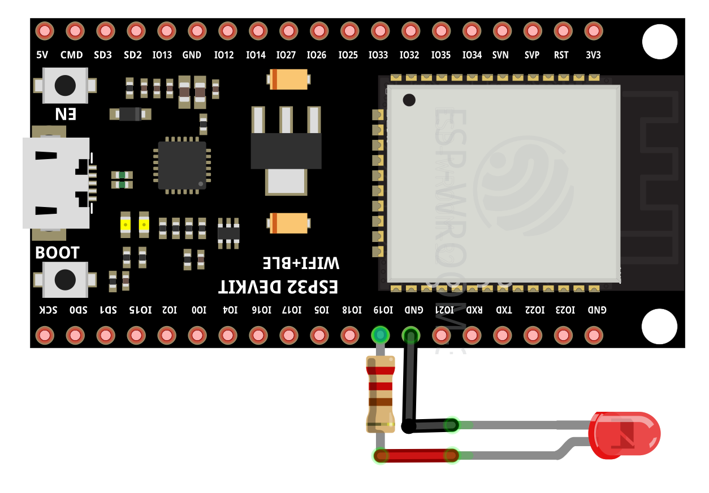
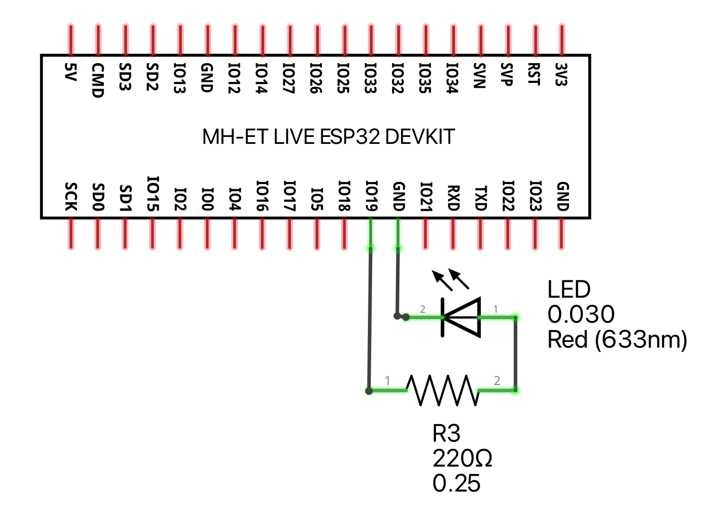

# Blinking example

This example prints 'blink' and makes the LED blink with an 1 second frequency.

## Running the examples

Wire your ESP32 and the LED according to:





```bash
toit run blinking.toit
```

## License

[BSD0](https://choosealicense.com/licenses/0bsd/)
