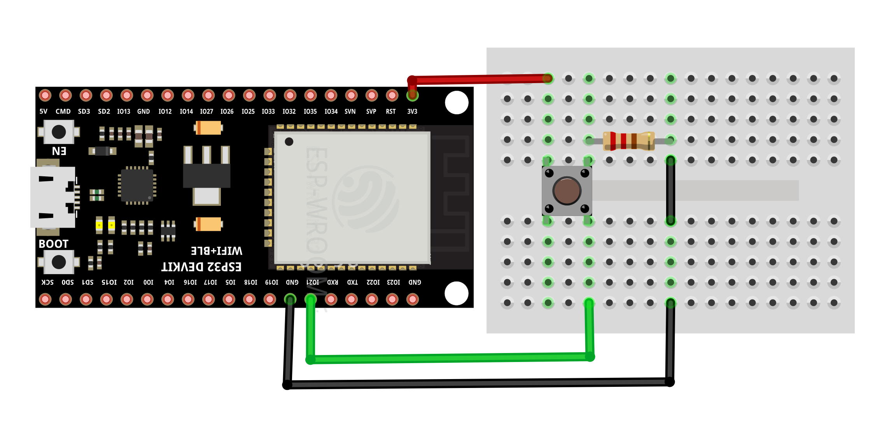
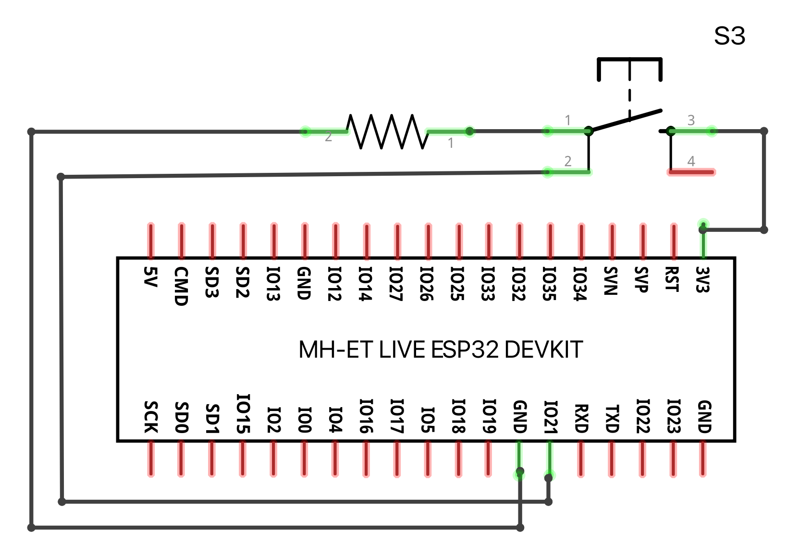

# Button example

This example prints 'Button clicked', when you press the connected button.

## Running the example

Wire your ESP32 and the button according to:





To run the example on your ESP32, execute the following command:

```bash
toit run button.toit
```

## License

[BSD0](https://choosealicense.com/licenses/0bsd/)
