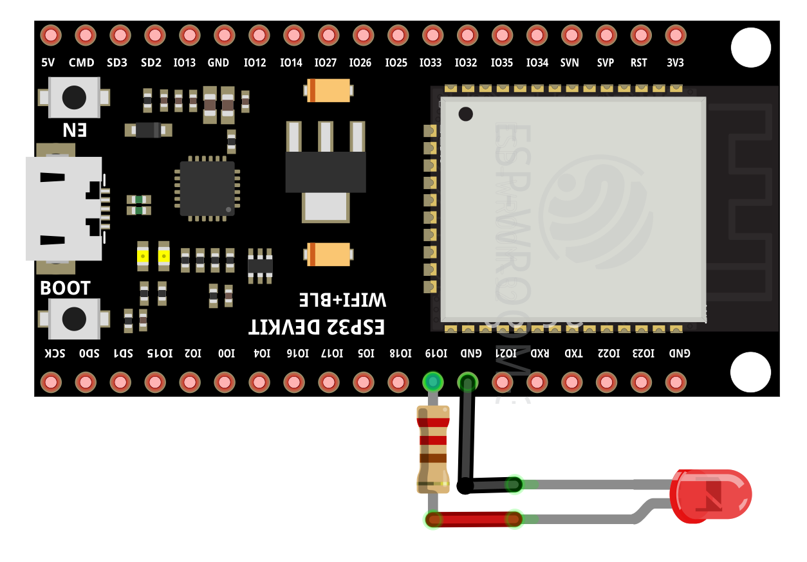
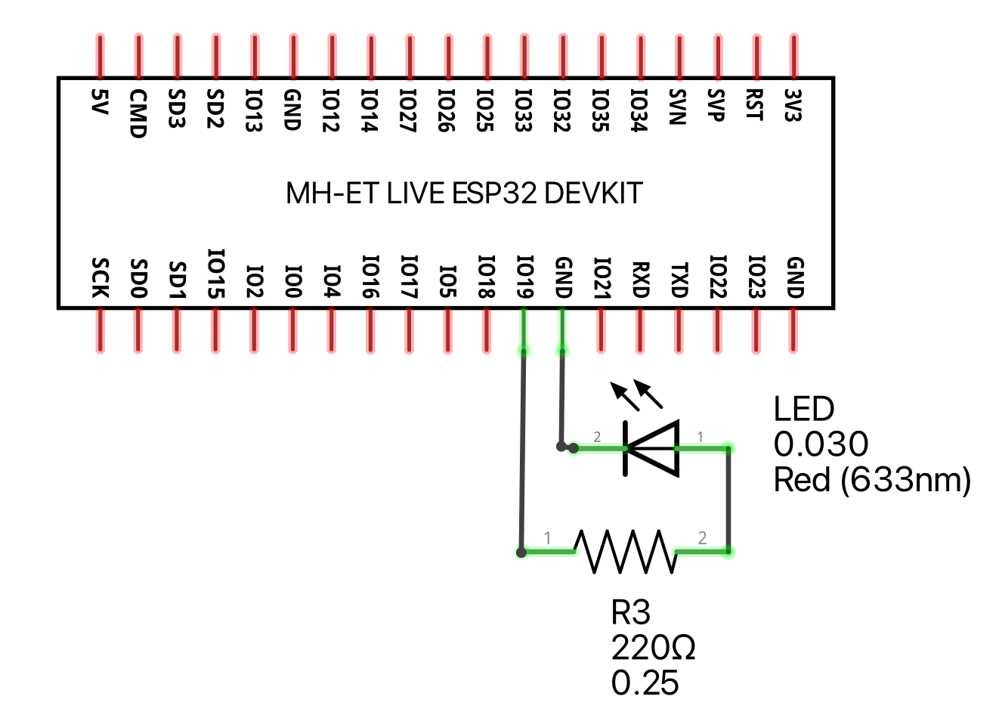

# Fading example

This example increases and decreases the lighting level of a LED over and over again.

## Running the example

Wire your ESP32 and the LED according to:





To run the example on your ESP32, execute the following command:

```bash
toit run fading.toit
```
