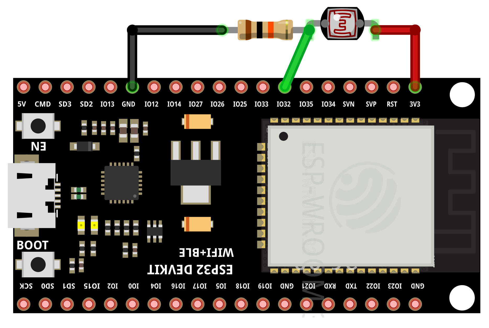
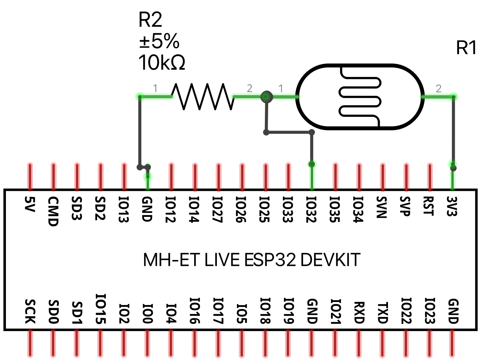

# Photoresistor example

This example prints whether the lighting level is above the threshold.

## Running the example

Wire your ESP32 and the photoresistor according to:





To run the example on your ESP32, execute the following command:

```bash
toit run photoresistor.toit
```

## License

[BSD0](https://choosealicense.com/licenses/0bsd/)
