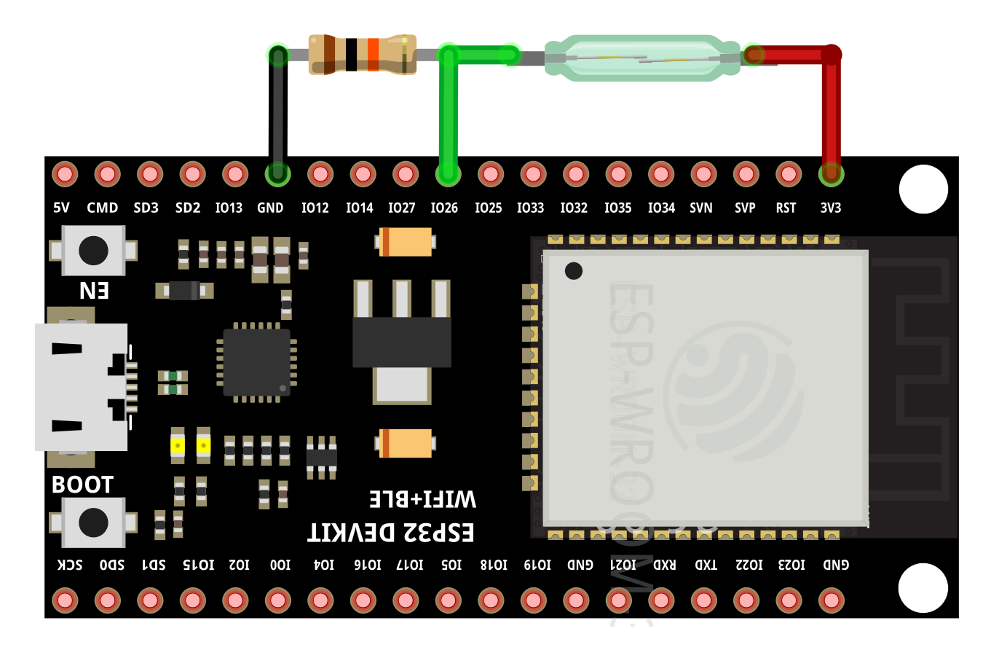
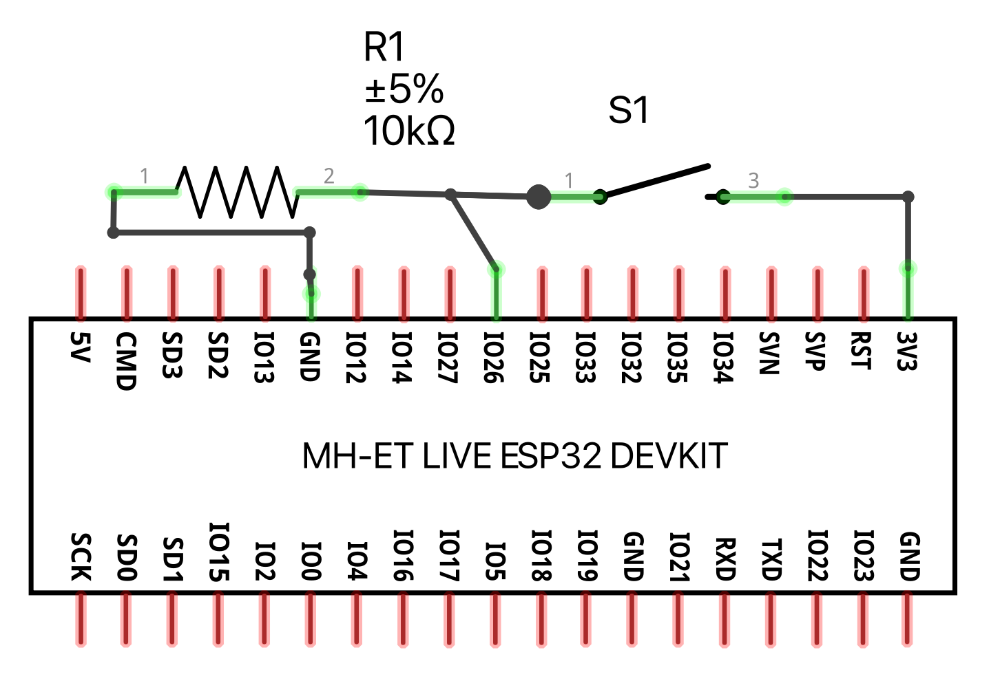

# Reed sensor example

This example prints 'contact' and 'no contact' depending on the state of the reed switch.

## Running the example

Wire your ESP32 and the reed sensor according to:





To run the example on your ESP32, execute the following command:

```bash
toit run reed.toit
```
